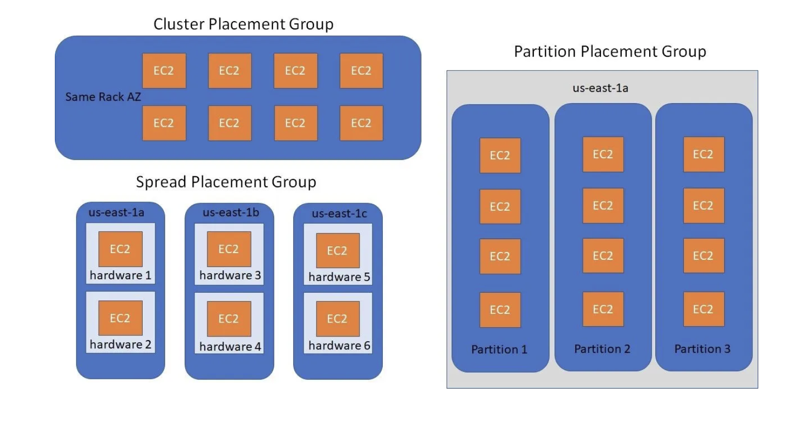

# Compute (EC2)

### **SECTION 1: INSTANCE TYPES (THE FLEET)**

*The Hardware Options.*

### **1. Instance Types (The Naming Convention)**

- **Pattern:** `m5.2xlarge`
    - `m` = Instance Family (General Purpose)
    - `5` = Generation (Higher = Newer)
    - `2xlarge` = Size (nano, micro, small, medium, large, xlarge, 2xlarge, etc.)

**Instance Families (Memorize the Use Cases)**

| **Family** | **Name** | **Use Case** | **Exam Trigger** |
| --- | --- | --- | --- |
| **T2/T3/T4g** | Burstable | Dev/Test, Low Traffic Web Servers | "Variable CPU", "Burst Credits", "Cost-effective" |
| **M5/M6** | General Purpose | Balanced workloads, App Servers | "Standard workload", "Balance compute/memory" |
| **C5/C6** | Compute Optimized | Batch processing, HPC, Gaming Servers | "High CPU", "Compute-intensive" |
| **R5/R6** | Memory Optimized | In-Memory DBs (Redis, SAP HANA) | "High memory", "Database", "Cache" |
| **I3/I4i** | Storage Optimized | NoSQL DBs, Data Warehousing, OLTP | "High IOPS", "Low latency storage" |
| **G/P** | GPU | ML Training, Graphics, Deep Learning | "GPU", "ML Training", "3D rendering" |

> *Memory tip:* Only the 6 above get tested. Letter = job: **T**iny/burst, **M**ain/balanced, **C**ompute, **R**AM, **I**OPS storage, **G**PU.

**Burstable (T2/T3) — CPU Credits:** Earn credits while idle, spend them during bursts. Run out → CPU throttled. Fix: enable **Unlimited** mode (auto-pay for extra CPU) or move to M5.
- *Exam Trap:* "Web server fine at night, slow during day" → T2 credits exhausted.

---

### **SECTION 2: PURCHASING OPTIONS (THE PRICING)**

*How You Pay.*

| **Model** | **Commitment** | **Savings** | **Exam Trigger** |
| --- | --- | --- | --- |
| **On-Demand** | None. Pay per second. | 0% | "Unpredictable workload", "Short-term", "Development" |
| **Reserved (RI)** | 1 Year or 3 Year contract | 40-75% | "Steady-state", "Database", "Predictable load" |
| **Convertible RI** | 1/3 Year. Can change instance family. | 30-66% | "Flexibility to change type" |
| **Savings Plan** | 1/3 Year. Commit to $/hour usage. | Similar to RI | "Flexibility across families/regions" |
| **Spot Instances** | Use spare capacity at market price. Set max price (default = On-Demand). Interrupted with 2-min notice if spot price exceeds max. | Up to 90% | "Batch jobs", "Fault-tolerant", "Big Data" |
| **Dedicated Hosts** | Physical server for you. | Expensive | "Per-socket licensing" (Oracle, Windows Server), "Compliance" |
| **Dedicated Instances** | Instances on hardware dedicated to you (but AWS controls placement). | Less expensive | "Regulatory isolation", "No per-socket needs" |

**Spot Instances — key facts:**

- Spare AWS capacity at fluctuating price. You set a **max price**; if market price exceeds it → interrupted with **2-min warning** (no bidding).
- **Spot Fleet:** mixes Spot + On-Demand to keep target capacity.
- *Exam Trap:* "Cheapest for non-critical / fault-tolerant batch jobs" → Spot.

### **3. EC2 Capacity Reservations**

- **The Rule:** Reserves capacity for EC2 instances in a **specific AZ**. Guarantees you can launch instances when needed.
- **NOT a billing discount** — you pay On-Demand price whether you use the capacity or not.
- **Combine with Savings Plans or RIs** for both capacity guarantee AND billing discount.
- **No commitment required** — create/cancel anytime.
- *Exam Trigger:* "Guarantee capacity in a specific AZ" → Capacity Reservation.

---

### **SECTION 3: PLACEMENT GROUPS (THE TOPOLOGY)**

*Where Instances Live Relative to Each Other.*

| **Type** | **Behavior** | **Use Case** | **Exam Trigger** |
| --- | --- | --- | --- |
| **Cluster** | All instances packed in **same rack** (same AZ). | Low latency (10 Gbps network), HPC, Tightly coupled apps | "Lowest latency", "High throughput", "Big Data" |
| **Spread** | Each instance on **different hardware** (max 7 per AZ). | Critical apps where failure isolation is required | "Maximize availability", "Isolated failures" |
| **Partition** | Divides instances into **partitions** (racks). Each partition on different hardware. | Hadoop, Cassandra, Kafka (Distributed systems) | "Large distributed workloads", "Partition-aware" |

**Rules:**

- **Cluster:** Cannot span multiple AZs. Risk = If rack fails, all instances fail.
- **Spread:** Can span AZs. Limit = 7 instances per AZ per group.
- **Partition:** Can span AZs. Each partition is isolated (1 partition = 1 rack).

---

### **SECTION 4: NETWORKING (ELASTIC NETWORK INTERFACES)**

*The Network Cards.*

### **1. ENI (Elastic Network Interface)**

- **The Rule:** The standard virtual network card.
- **Features:**
    - Can attach/detach from instances.
    - Can have **multiple ENIs** on one instance (e.g., separate public/private traffic).
    - Use Case: Failover (Move ENI from failed instance to standby).
- *Exam Trap:* "How to preserve a private IP when moving workloads?" → Attach ENI to new instance.

### **2. ENA (Elastic Network Adapter)**

- **The Rule:** Enhanced Networking. **Up to 100 Gbps** bandwidth.
- **Mechanism:** SR-IOV (Hardware acceleration).
- **Exam Trigger:** "High throughput", "Low latency networking", "HPC".

### **3. EFA (Elastic Fabric Adapter)**

- **The Rule:** For **HPC** and **ML** workloads requiring **OS-Bypass** (Bypasses kernel for ultra-low latency).
- **Protocols:** Supports MPI (Message Passing Interface).
- *Exam Trigger:* "Tightly coupled HPC", "Sub-millisecond latency between nodes", "ML distributed training".

### **4. Elastic IP**

- **The Rule:** Static public IPv4 address that you own until you release it.
- **Limit:** 5 per region (can request increase).
- **Charged** when **not** associated with a running instance (AWS discourages wasting IPv4 addresses).
- **Survives stop/start** — unlike the default public IP which changes on stop/start.
- *Exam Trigger:* "Static public IP that survives stop/start" → Elastic IP.

---

### **SECTION 5: STORAGE ATTACHED (AMIS & SNAPSHOTS)**

### **1. AMI (Amazon Machine Image)**

- **The Rule:** Template for an EC2 instance — OS + software baked in.
- **Scope:** **Regional**. Must copy to another region to use it there.
- **Create:** Stop instance (consistency) → Create Image → AMI = config + root EBS snapshot.
- **Sharing:** Can share across accounts. Can't share an AMI with an **encrypted snapshot** unless you also share the KMS key.

### **2. Instance Metadata (IMDSv2)**

- **The Rule:** Access instance info from *inside* the instance.
- **URL:** `http://169.254.169.254/latest/meta-data/`
- **Data Includes:** Instance ID, Public IP, IAM Role credentials, User Data.
- **IMDSv1 vs IMDSv2:** v1 = simple GET, vulnerable to SSRF (credential theft). v2 = token-based (PUT for token, then GET), SSRF-resistant. Enforce **"IMDSv2 only"** to block v1.
- *Exam Trigger:* "Secure metadata access", "Protect against SSRF credential theft" → Enforce IMDSv2.
- *Exam Trap:* "How does an instance retrieve its IAM role credentials?" → Metadata service (IMDSv2).

### **3. EC2 Instance Connect**

- **Purpose:** Browser-based SSH access to EC2 instances directly from the AWS Console.
- **No SSH key pairs needed** — AWS pushes a temporary public key for the session.
- **Works on:** Linux instances.
- *Exam Trigger:* "Access EC2 without managing SSH keys" → EC2 Instance Connect.

---

### **SECTION 6: EC2 LIFECYCLE (START, STOP, HIBERNATE)**

| **Action** | **EBS Root** | **Instance Store** | **RAM** | **Billing** |
| --- | --- | --- | --- | --- |
| **Stop** | Preserved | **Lost** | Lost | Stop paying for instance (Still pay for EBS) |
| **Terminate** | Deleted (unless DeleteOnTermination=false) | Lost | Lost | Stop paying everything |
| **Reboot** | Preserved | Preserved | Preserved | Continue paying |
| **Hibernate** | Preserved (RAM dumped to EBS) | Lost | **Saved to Disk** | Stop paying for instance |

**Hibernate Deep Dive:**

- **The Rule:** Saves RAM to root EBS, then stops instance. On start, RAM is restored.
- **Use Case:** Long-running processes, Pre-warmed caches.
- **Limits:** Max 60 days hibernate, Max 150 GB RAM, Root volume must be encrypted EBS.
- *Exam Trigger:* "Resume application with all in-memory state intact" → Hibernate.

---

### **SECTION 7: USER DATA & INSTANCE PROFILES**

### **1. User Data**

- **The Rule:** Bash script that runs **ONCE** at instance **FIRST BOOT**.
- **Use Case:** Install software, Configure settings, Pull code from S3.
- **Size Limit:** 16 KB max.
- **Access:** Available via Metadata service.
- *Exam Trap:* "Automatically configure instance at launch" → User Data.

### **2. IAM Instance Profile**

- **The Rule:** Attaches an **IAM Role** to an EC2 instance.
- **Credentials:** Auto-rotated by AWS. Retrieved via Metadata service.
- *Exam Trap:* "EC2 needs to access S3 without storing credentials" → Attach IAM Role via Instance Profile.

### **3. Launch Templates vs Launch Configurations**

- **Launch Template** = modern. Versioning, mixed instance types (Spot + On-Demand), T2/T3 Unlimited.
- **Launch Configuration** = legacy. No versioning, single instance type, no Spot mixing.
- *Exam Trigger:* Always pick **Launch Template**.

---

### **Exam Summary Cheat Sheet — Practice (Fill In Yourself)**

1. **Lowest latency between instances?** →
2. **Maximize fault isolation?** →
3. **Cheapest option for fault-tolerant batch jobs?** →
4. **T2 instance slow during business hours?** →
5. **Per-socket software licensing?** →
6. **HPC with sub-millisecond latency?** →
7. **Preserve private IP during failover?** →
8. **Resume app with RAM intact?** →
9. **Auto-install software at launch?** →
10. **EC2 needs S3 access without hardcoded keys?** →
11. **Guarantee capacity in a specific AZ?** →
12. **Static public IP that survives stop/start?** →
13. **Secure instance metadata / prevent SSRF?** →
14. **SSH to EC2 without key pairs?** →
15. **ASG launch config?** →

---

### **Exam Summary Cheat Sheet — Answer Key**

1. **Lowest latency between instances?** → Cluster Placement Group.
2. **Maximize fault isolation?** → Spread Placement Group.
3. **Cheapest option for fault-tolerant batch jobs?** → Spot Instances.
4. **T2 instance slow during business hours?** → CPU Credits exhausted. Use Unlimited or switch to M5.
5. **Per-socket software licensing?** → Dedicated Hosts.
6. **HPC with sub-millisecond latency?** → EFA (Elastic Fabric Adapter).
7. **Preserve private IP during failover?** → Attach ENI to new instance.
8. **Resume app with RAM intact?** → Hibernate.
9. **Auto-install software at launch?** → User Data script.
10. **EC2 needs S3 access without hardcoded keys?** → IAM Instance Profile.
11. **Guarantee capacity in a specific AZ?** → Capacity Reservation (not a discount — combine with Savings Plans/RIs).
12. **Static public IP that survives stop/start?** → Elastic IP (charged when unassociated).
13. **Secure instance metadata / prevent SSRF?** → Enforce IMDSv2 (token-based).
14. **SSH to EC2 without key pairs?** → EC2 Instance Connect.
15. **ASG launch config?** → Launch Template (not Launch Configuration — it's legacy/deprecated).

---

# **REAL EXAM SCENARIOS**

### Scenario 1

**The Situation:** Your development team is running a web application on a `t2.medium` instance. During business hours (9 AM - 5 PM), users report that the application becomes extremely slow. At night and on weekends, the application performs normally. CloudWatch shows CPU at 100% during business hours but low at night.

**The Options:**

A. Increase the EBS volume size.

B. Switch to a `t2.medium` with Unlimited mode enabled.

C. Enable Auto Scaling.

D. Add more Security Group rules to allow traffic.

**The Logic:**

- **Trap A — EBS:** Storage is not the bottleneck. CloudWatch shows the symptom is **CPU at 100%**, not disk I/O.
- **Trap C — Auto Scaling:** Plausible-looking, but it's a single `t2.medium`, and the real cause is **CPU credit exhaustion**, not lack of instances. Scaling out a credit-starved instance type just multiplies a flawed choice and adds cost. Fix the instance type first.
- **Trap D — Security Groups:** SG rules control *connectivity*, not performance. The app is reachable (it works at night) — adding rules changes nothing.
- **The Fix — Option B:** T2/T3 instances earn CPU credits when idle. During business hours the app burns through its credits and gets **throttled**. **T2 Unlimited** lets it pay for CPU beyond the credit balance. Alternative: move to **M5** for flat, steady performance with no credit system.

---

### Scenario 2

**The Situation:** A company needs to process large video rendering jobs overnight. The jobs are **fault-tolerant** (can restart from checkpoints) and not time-sensitive. The current On-Demand fleet costs $5,000/month. The CFO wants to reduce costs by at least 70%.

**The Options:**

A. Purchase 3-year Reserved Instances.

B. Switch to Lambda for processing.

C. Use Dedicated Hosts.

D. Use Spot Instances with Spot Fleet.

**The Logic:**

- **Trap A — Reserved Instances:** The real disqualifier is **workload fit**, not the savings number. RIs are a 1-3 year commitment for **steady-state, 24/7, predictable** load. This job runs *overnight only* and is *not time-sensitive* — committing to 3 years of capacity for a few hours/night is wasteful and inflexible. (3-year RIs *can* technically reach ~72%, so don't eliminate A on the discount alone — eliminate it because the workload shape is wrong.)
- **Trap B — Lambda:** 15-minute max execution time. Video rendering takes hours per job — Lambda physically cannot run it.
- **Trap C — Dedicated Hosts:** The *most expensive* option. Used for per-socket licensing / compliance isolation — the question asks for the *cheapest*, the opposite goal.
- **The Fix — Option D:** The workload is **fault-tolerant, checkpoint-able, and not time-sensitive** — the textbook Spot profile. Spot saves up to **90%**, clearing the 70% target with huge margin, and has **zero commitment**. **Spot Fleet** spreads requests across instance types/pools to keep capacity available despite interruptions.

---

### Scenario 3

**The Situation:** A financial modeling application requires **10 Gbps network bandwidth** between nodes for tightly-coupled parallel processing. The workload cannot tolerate network latency spikes. All instances must be in the **same Availability Zone** for the application to function correctly.

**The Options:**

A. Use a Spread Placement Group.

B. Use a Partition Placement Group.

C. Use a Cluster Placement Group.

D. Place instances in different AZs with VPC Peering.

**The Logic:**

- **Trap A — Spread:** Optimizes for *failure isolation* by putting each instance on different hardware — the opposite of what's needed. Spreading instances apart *increases* network latency between them.
- **Trap B — Partition:** Designed for large distributed systems (Hadoop, Cassandra) that are *partition-aware*. It isolates groups of instances onto separate racks — again the opposite of packing them tightly for low latency.
- **Trap D — Different AZs + VPC Peering:** The question explicitly says all instances **must be in the same AZ**. Cross-AZ traffic adds latency and breaks the requirement outright.
- **The Fix — Option C:** A **Cluster Placement Group** packs instances onto the **same rack in one AZ**, giving the **low-latency, high-throughput 10 Gbps** networking that tightly-coupled HPC needs. Trade-off: if that rack fails, all instances fail — acceptable here because performance is the stated priority.

---

### Scenario 4

**The Situation:** Your company uses Oracle Database with per-socket licensing. Oracle requires you to track exactly how many physical CPU sockets are in use for licensing compliance. The database workload is steady and runs 24/7.

**The Options:**

A. Use Dedicated Hosts.

B. Use On-Demand Instances.

C. Use Reserved Instances.

D. Use Spot Instances.

**The Logic:**

- **Trap B — On-Demand:** Standard multi-tenant hardware — AWS controls placement, you get no socket/core visibility. Fails the Oracle compliance requirement.
- **Trap C — Reserved Instances:** RIs are a *billing discount*, not a tenancy model. They run on shared hardware just like On-Demand — no physical socket visibility.
- **Trap D — Spot:** Interruptible spare capacity, also shared hardware. Wrong on both counts: no socket visibility, and you can't run a steady 24/7 production database on instances that get reclaimed.
- **The Fix — Option A:** **Dedicated Hosts** give you an entire physical server with visible socket and core counts — exactly what per-socket licensing (Oracle, some Windows Server) requires. Pair with **License Manager** to track and enforce compliance.

---

### Scenario 5

**The Situation:** You have a critical application running on an EC2 instance with a **static private IP** that is hardcoded in many downstream systems. If the primary instance fails, you need to launch a standby instance and have it immediately take over the **same private IP** to avoid reconfiguring downstream systems.

**The Options:**

A. Use Route 53 to update DNS records.

B. Detach the ENI from the failed instance and attach it to the standby instance.

C. Use an Application Load Balancer.

D. Use an Elastic IP and reassign it to the new instance.

**The Logic:**

- **Trap A — Route 53:** DNS-based failover means downstream systems would resolve a *new* IP, and DNS changes take time to propagate (TTL-bound, often minutes). The systems hardcode an **IP, not a hostname**, so DNS doesn't even help here.
- **Trap C — Application Load Balancer:** An ALB introduces a new endpoint (its own DNS name) and is built for distributing traffic across many targets — it doesn't let a standby instance *inherit a specific private IP*. Wrong tool for an IP-failover requirement.
- **Trap D — Elastic IP:** An Elastic IP is a *public* IPv4 address. The requirement is to preserve a hardcoded **private** IP — an EIP doesn't apply.
- **The Fix — Option B:** An **ENI** can be detached from the failed instance and attached to the standby. The **private IP, MAC address, and Security Groups** all move with the ENI — instant failover, no downstream reconfiguration.
