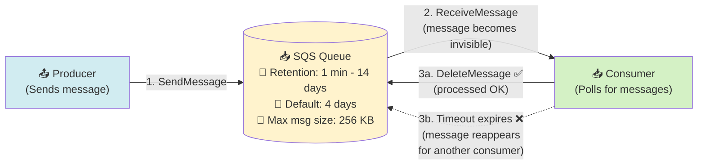
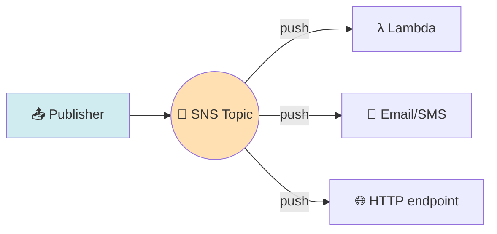
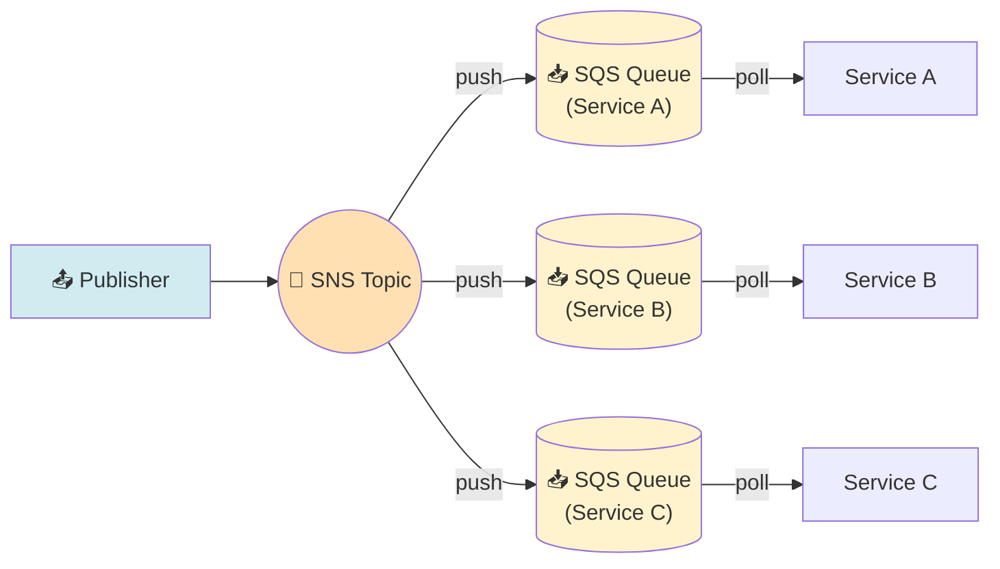
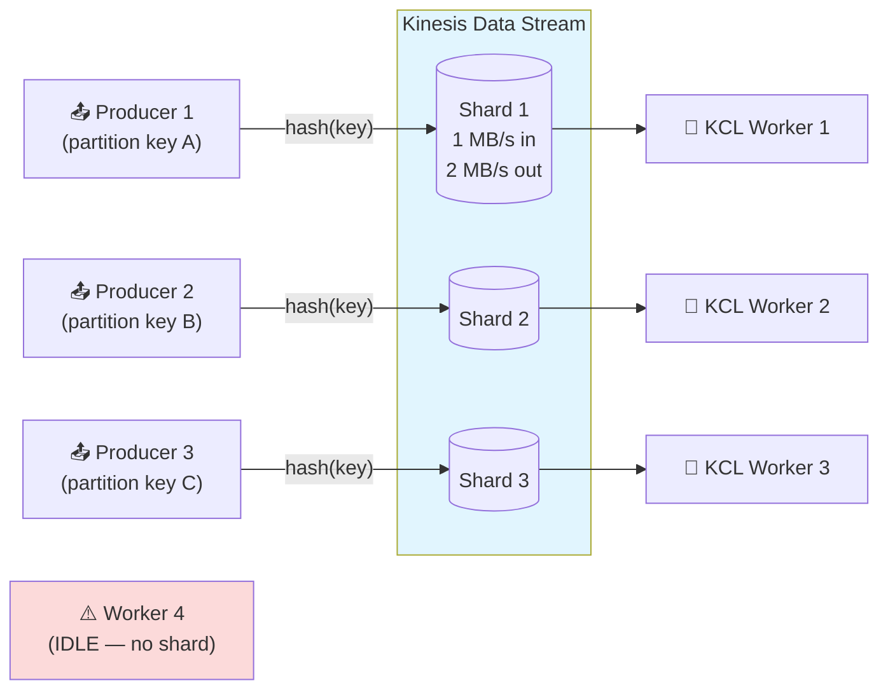
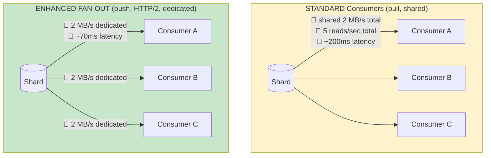
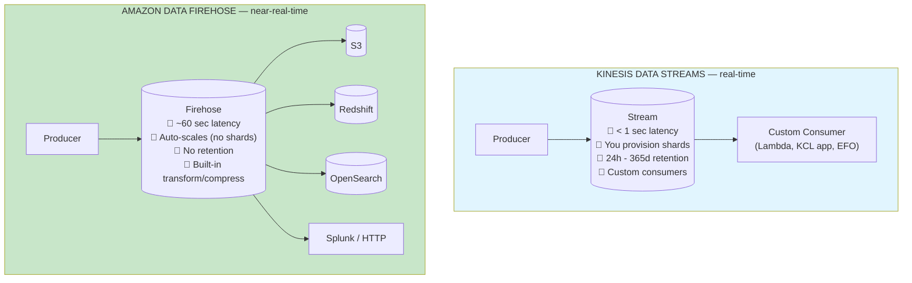
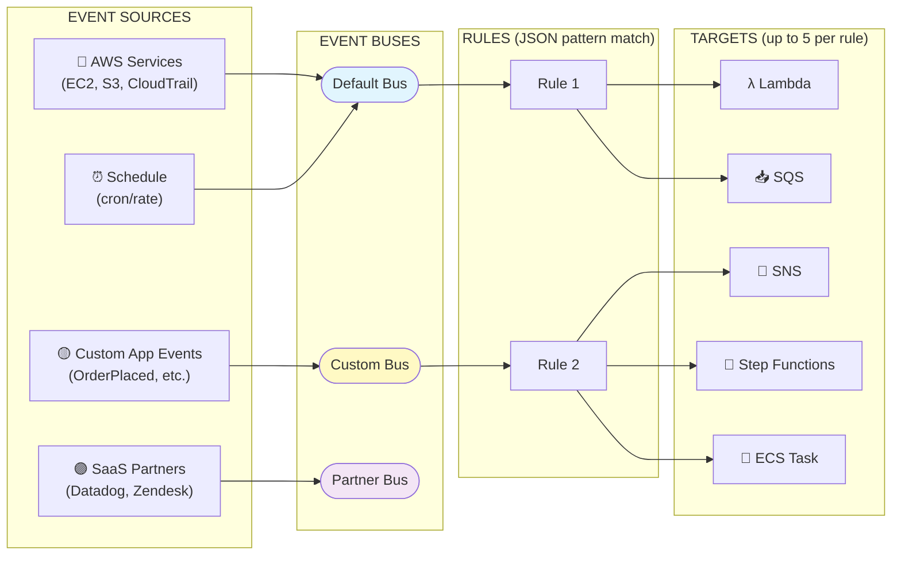
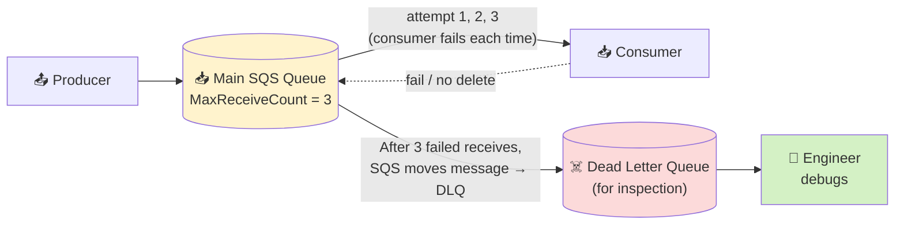

# Decoupling — Visual Reference (Mermaid Diagrams)

> Visual companion to [Decoupling.md](./Decoupling.md). Render in VS Code (Markdown Preview Mermaid Support plugin) or directly on GitHub.

## Table of Contents

1. [SQS — Basic Flow + Visibility Timeout](#1-sqs--basic-flow--visibility-timeout)
2. [SNS Fan-Out vs SNS + SQS Fan-Out](#2-sns-fan-out-vs-sns--sqs-fan-out)
3. [Kinesis Data Streams — Shards + KCL Workers](#3-kinesis-data-streams--shards--kcl-workers)
4. [Kinesis Standard vs Enhanced Fan-Out](#4-kinesis-standard-vs-enhanced-fan-out)
5. [Kinesis Data Streams vs Firehose](#5-kinesis-data-streams-vs-firehose)
6. [EventBridge — Buses, Rules, Targets](#6-eventbridge--buses-rules-targets)
7. [DLQ — Poison Message Pattern](#7-dlq--poison-message-pattern)
8. [The 5 Mental Rules to Take to the Exam](#8-the-5-mental-rules-to-take-to-the-exam)

---

## 1. SQS — Basic flow + Visibility Timeout

**Visibility Timeout:** when a consumer receives a message, it becomes **invisible** to other consumers for the timeout (default **30 sec**, max **12 hours**). The consumer MUST delete before the timeout, or the message returns to the queue.

**Exam trap:** *"Message processed multiple times"* → **increase Visibility Timeout** (consumer is too slow). Use `ChangeMessageVisibility` API to extend mid-processing.

**Polling:**
- **Short polling** (default): returns immediately, even empty → wasted API calls.
- **Long polling** (`WaitTimeSeconds = 1-20`): waits up to 20s → fewer empty responses, lower cost. **Exam trigger:** *"reduce SQS API calls"* → enable Long Polling.

---

## 2. SNS Fan-Out vs SNS + SQS Fan-Out

### A. Direct SNS Fan-Out (less resilient)

**Problem:** SNS is **push-and-forget**. If a subscriber is throttled, down, or erroring, the message can be **lost** (only limited retries, no durable buffer).

---

### B. SNS + SQS Fan-Out (resilient — the textbook pattern)

**Why it's better:** each SQS queue **persists** messages until consumed. If Service B goes down, its queue **buffers** the messages until it comes back.

**Exam trigger:** *"Send same message to multiple services, must be reliable / each service scales independently"* → **SNS + SQS Fan-Out**.

---

## 3. Kinesis Data Streams — shards + KCL workers

**The 1-worker-per-shard rule:** KCL gives **one** active worker per shard. 3 shards = max 3 active workers. **Worker 4 sits idle.**

**Exam trigger:** *"Scale Kinesis consumers"* → **add shards (splitting)** AND add workers. *"More consumers than shards = idle workers"* → add shards first.

**Concepts:**
- **Shard** = capacity unit (1 MB/s in, 2 MB/s out).
- **Partition Key** = determines which shard a record lands on (consistent hash).
- **Retention** = 24h (default) to **365 days**.
- KCL checkpoints in a **DynamoDB** table.

---

## 4. Kinesis Standard vs Enhanced Fan-Out

**Exam trigger:** *"Multiple consumers, each needs full throughput, low latency"* → **Enhanced Fan-Out**. *"Cost matters, few consumers"* → Standard.

---

## 5. Kinesis Data Streams vs Firehose

**Buffer rule for Firehose:** flushes when buffer time (**60s min**) OR buffer size (**1-128 MB**) is reached — that's why it's NEVER sub-second.

**Exam triggers:**
- *"Real-time, custom processing, replay last 7 days"* → **Data Streams**
- *"Load streaming data to S3 without code"* → **Firehose**
- *"Transform + compress + load to S3 with zero servers"* → **Firehose + Lambda transform**

---

## 6. EventBridge — buses, rules, targets

**Key facts:**
- 1 rule → **up to 5 targets**.
- **Default Bus** = AWS service events (free-tier).
- **Custom Bus** = your app's events.
- **Partner Bus** = SaaS partners (Datadog, Auth0, Zendesk).
- **Archive & Replay** = replay past events for testing/debugging.
- **Scheduler** = cron/rate (replaces CloudWatch Events scheduled rules).

**Exam triggers:**
- *"React to AWS service events (EC2 state change, S3 upload, CloudTrail API call)"* → **EventBridge**
- *"Schedule a cron job in AWS"* → **EventBridge Scheduler**
- *"Replay past events for debugging"* → **EventBridge Archive & Replay**
- *"Cross-account event routing"* → **EventBridge**

**EventBridge vs SNS:** EventBridge has **advanced JSON filtering, scheduling, archive/replay, 18+ AWS targets**. SNS is simpler pub/sub (Lambda/SQS/HTTP/email/SMS only, no scheduling, no archive).

---

## 7. DLQ — Poison Message Pattern

**Why it matters:** without a DLQ, a single **poison message** keeps re-appearing and **blocks the queue** — every consumer keeps timing out on it instead of processing real messages.

**Rules:**
- DLQ is just **another SQS queue** (Standard DLQ for Standard source, FIFO DLQ for FIFO source).
- `MaxReceiveCount` is set in the **redrive policy** on the main queue (typical: 3-5).
- DLQ messages have their own retention (often 14 days for max debug window).

**Exam trigger:** *"Handle messages that repeatedly fail processing / prevent poison messages"* → **Dead Letter Queue**.

---

## 8. The 5 mental rules to take to the exam

1. **SQS = pull (queue), SNS = push (pub/sub), EventBridge = router with rules + scheduling.**
2. **SNS alone = fire-and-forget. SNS + SQS = durable fan-out** (each service has its own buffer).
3. **Kinesis = streaming (real-time, replay), SQS = work queue (deleted on consume, no replay).**
4. **1 KCL worker per shard.** More workers than shards = idle. Scale = **add shards + add workers**.
5. **Firehose ≠ real-time** (60s min buffer). If question says "sub-second" → **Data Streams**. If question says "load to S3 / no code" → **Firehose**.

---

## Common trigger → service cheat strip

| Trigger phrase | Answer |
|---|---|
| Decouple producer/consumer | **SQS** |
| Strict ordering, no duplicates | **SQS FIFO** |
| Highest throughput, duplicates OK | **SQS Standard** |
| Reduce SQS API calls | **Long Polling** |
| Message processed multiple times | **Increase Visibility Timeout** |
| Repeatedly failing messages | **DLQ** |
| Send same message to multiple services | **SNS + SQS Fan-Out** |
| Subscriber filters by message type | **SNS Message Filtering** |
| Sub-second real-time + replay 7 days | **Kinesis Data Streams** |
| Load streaming data to S3, no code | **Amazon Data Firehose** |
| Migrate RabbitMQ from on-prem | **Amazon MQ** |
| Schedule cron jobs in AWS | **EventBridge Scheduler** |
| React to AWS service events | **EventBridge** |
| Replay past events for debugging | **EventBridge Archive & Replay** |
| SQS message > 256 KB | **SQS Extended Client Library** (S3 ref) |
