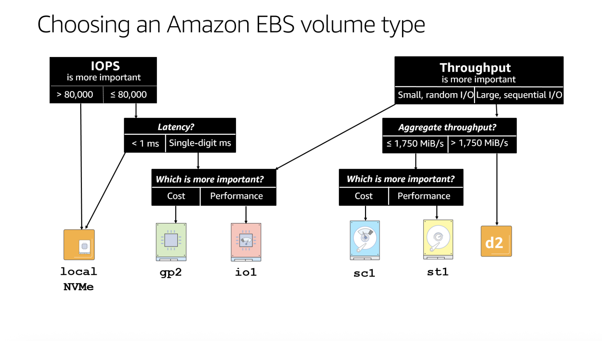

# Storage

### **SECTION 1: BLOCK STORAGE (EBS & INSTANCE STORE)**

*The "Hard Drive" attached to your EC2.*

### **1. Instance Store (Ephemeral Storage)**

- **The Rule:** Physically-attached SSD/HDD on the host. **Ephemeral** — survives **reboot**, lost on **stop** or hardware failure.
- **Performance:** Highest possible IOPS (millions) — local, not network-attached.
- **Use Case:** Cache, buffers, temporary content, distributed data stores (Kafka, Cassandra) where the app handles replication.
- **Exam Trap:** "High I/O needs and data can be lost" → **Instance Store**.

### **2. EBS (Elastic Block Store)**

- **The Rule:** Network-attached, **persistent** drive (data survives a stop). Slightly higher latency than Instance Store.
- **Scope:** Locked to **ONE AZ**. To move: Snapshot → Copy Snapshot to Region/AZ → Create Volume.

**EBS Volume Types (The IOPS/Throughput Game)**

| **Type** | **Name** | **Use Case** | **Performance / IOPS** | **Exam "Trigger"** |
| --- | --- | --- | --- | --- |
| **General Purpose** | **gp2** | Boot volumes, Dev/Test | **IOPS Linked to Size.** 3 IOPS per GB (min 100, max 16,000 IOPS). | "Balance price/performance" |
| **General Purpose** | **gp3** | **Default Choice.** | **Decoupled Performance.** You get 3,000 IOPS baseline free. You pay to increase IOPS without increasing size. | "Independent scaling of storage and IOPS" |
| **Provisioned IOPS** | **io1 / io2** | Mission Critical DBs | **High IOPS.** io1: up to 32,000 IOPS. io2: up to 64,000 IOPS. | "Sub-millisecond latency", "Sustained IOPS" |
| **Block Express** | **io2 Block Express** | The "SAN" Killer | Up to **256,000 IOPS**. Sub-millisecond latency. Highest EBS performance. | "Mission critical", "SAP HANA", "256K IOPS" |
| **Throughput Opt HDD** | **st1** | Big Data, Logs, Kafka | Optimized for **Throughput (MB/s)**, not IOPS. Max 500 MB/s. | "Streaming", "Log processing", "Sequential I/O" |
| **Cold HDD** | **sc1** | Archive | Cheapest EBS. Infrequent access. | "Lowest cost block storage" |

**EBS Features:**

- **Multi-Attach:** Only available on **io1 / io2**. Allows *one* volume to attach to *multiple* EC2 instances in the *same* AZ. (Cluster-aware apps only).
- **Encryption:** Enabled by default or at creation.
    - *How to encrypt an unencrypted volume?* Snapshot (Unencrypted) → Copy Snapshot (Check "Encrypt" box) → Create Volume from Encrypted Snapshot.
- **Delete on Termination:**
    - **Root Volume:** Default = **Delete**. (OS disk vanishes when EC2 terminates).
    - **Data Volume:** Default = **Keep**. (Extra disk stays).
    - *Exam Trap:* "Preserve the root volume data" → Change attribute `DeleteOnTermination` to `False`.

**EBS Snapshots:**

- **Incremental:** Only changed blocks since the last snapshot are saved. First snapshot is full copy.
- **Stored in S3** internally (you cannot see them in your S3 console).
- **Cross-Region Copy:** Snapshot → Copy to another Region → Create Volume. This is how you migrate EBS across regions.
- **Data Lifecycle Manager (DLM):** Automate snapshot creation, retention, and deletion on a schedule. *Exam Trigger:* "Automate EBS backups" → DLM.
- **Fast Snapshot Restore (FSR):** Pre-warms the snapshot so volumes created from it have **no latency penalty** on first read. Costs money. *Exam Trigger:* "Eliminate latency on first access from snapshot" → FSR.
- *Exam Trap:* Snapshots are **not real-time backups**. For crash-consistent snapshots, stop I/O or detach the volume first.

---

### **SECTION 2: OBJECT STORAGE (S3)**

*The "Unlimited Bucket" for files.*

**1. Consistency Model**

- **Strong Consistency:** Write then immediately read → you get the new version. No eventual-consistency delay.

**2. Storage Classes (Memorize the Waterfall)**

| **Class** | **Availability** | **Minimum Duration** | **Retrieval Fee?** | **Exam Trigger** |
| --- | --- | --- | --- | --- |
| **Standard** | 99.99% | None | No | "Frequently accessed", "Instant" |
| **Standard-IA** | 99.9% | 30 Days | Yes | "Disaster Recovery", "Once a month access" |
| **Intelligent-Tiering** | 99.9% | None | No | "Unknown/Changing access patterns" (has 6 tiers incl. Archive Access + Deep Archive Access) |
| **One Zone-IA** | **Risk of Data Loss** | 30 Days | Yes | "Recreatable data", "Secondary backup", "Cheapest instant access" |
| **Glacier Instant** | 99.9% | 90 Days | Yes | "Archive but need millisecond access" |
| **Glacier Flexible** | 99.9% | 90 Days | No (Standard) | "Bulk retrieval", "Wait 3-5 hours" |
| **Glacier Deep Archive** | 99.9% | 180 Days | No | "Compliance", "Retain for 7 years", "Wait 12 hours" |
| **Express One Zone** | 99.95% (Single AZ) | None | No | "Single-digit ms latency", "Frequently accessed in one AZ" |

**3. S3 Performance Optimization**

- **Multipart Upload:** Required for files > 5GB. Recommended for > 100MB. Uploads parts in parallel.
- **S3 Transfer Acceleration:** Uses AWS Edge Locations to speed up uploads over the public internet. (Cost money).
- **Byte-Range Fetches:** Download specific parts of a file. (Speeds up getting just the header of a video).

**4. Security & Encryption**

- **Bucket Policies:** JSON. **Global**. "Allow Public Access" is blocked by default at the account level.
- **Encryption Types:**
    - **SSE-S3:** AWS manages keys. (Default).
    - **SSE-KMS:** AWS manages keys, but you control permissions/rotation. **Impacts KMS Quotas** (Exam trap: "Uploads failing due to ThrottlingException" -> Check KMS limits).
    - **SSE-C:** Client (You) sends the key with every request. AWS does not store the key.

**5. S3 Versioning**

- Keeps every version of every object (including deletions). Once enabled, can only be **suspended**, not disabled — existing versions are preserved.
- **Delete Behavior:** Simple DELETE → places a **Delete Marker** (soft delete; recover by removing it). Permanent DELETE requires the exact **Version ID**.
- **MFA Delete:** Optional. Requires MFA to permanently delete versions or change versioning state. Enabled only by **root account** via CLI.
- **Required for Replication** (CRR/SRR) on both source and destination buckets.
- *Exam Trap:* "Protect against accidental deletion" → Enable Versioning (+ optionally MFA Delete).

**6. S3 Lifecycle Policies**

- **Transition Rules:** Automatically move objects between storage classes over time.
    - Example: Standard → Standard-IA (after 30 days) → Glacier Flexible (after 90 days) → Deep Archive (after 180 days).
    - *Constraint:* Cannot transition from Standard-IA to One Zone-IA. The "waterfall" only goes down.
- **Expiration Rules:** Automatically delete objects or old versions after a set period.
    - Can also clean up **incomplete multipart uploads** (important cost-saving exam trap).
- **Minimum Storage Duration Charges:**
    - Standard-IA / One Zone-IA: **30 days** (delete early = still charged for 30 days).
    - Glacier Instant / Glacier Flexible: **90 days**.
    - Glacier Deep Archive: **180 days**.
- *Exam Trigger:* "Reduce storage costs over time" or "Archive old data automatically" → Lifecycle Policy.
- Question says "unknown / changing / unpredictable access patterns" → Intelligent-Tiering
- Question says "data is rarely accessed after X days" or "automatically delete/expire after X days" → Lifecycle Policy
**7. S3 Replication**

- **CRR (Cross-Region):** to a **different region** — compliance, low-latency access, DR. **SRR (Same-Region):** within one region — log aggregation, prod/test replication.
- **Requirements:** Versioning enabled on both buckets + an IAM role for S3.
- **Key Rules:** Existing objects are NOT replicated (use **S3 Batch Replication**). No chaining (A→B→C doesn't propagate A to C). Delete markers not replicated by default (optional). Permanent deletes by version ID are never replicated.
- *Exam Trap:* "Replicate existing objects" → S3 Batch Replication.

**8. S3 Object Lock & Glacier Vault Lock**

- **S3 Object Lock:** WORM (Write Once, Read Many) compliance at the object level.
    - **Requires Versioning** to be enabled.
    - **Governance Mode:** Users with special IAM permissions (`s3:BypassGovernanceRetention`) can override/delete. Good for internal controls.
    - **Compliance Mode:** **Nobody** can delete or overwrite — not even the root account. The retention period cannot be shortened. Use for regulatory compliance.
    - **Retention Period:** Set a fixed time window (days/years) during which the object is protected.
    - **Legal Hold:** Indefinite protection until explicitly removed. Independent of retention period.
- **Glacier Vault Lock:** WORM compliance at the **vault level** using a Vault Lock Policy.
    - Once the policy is locked, it can **never** be changed or deleted.
    - *Exam Trigger:* "Regulatory compliance", "SEC Rule 17a-4", "Data cannot be deleted for 7 years" → Glacier Vault Lock or S3 Object Lock (Compliance Mode).

**9. S3 Pre-signed URLs**

- Temporary URL granting time-limited access to a **private** object; inherits the generating IAM identity's permissions.
- **Expiration:** Default 1 hour, max 7 days (IAM user credentials). Works for download or upload to a specific key.
- *Exam Trigger:* "Temporary access to a private object", "Share a file without making it public", "Allow upload without AWS credentials" → Pre-signed URL.

**10. S3 Event Notifications**

- **Triggers:** `s3:ObjectCreated:*`, `s3:ObjectRemoved:*`, `s3:ObjectRestore:*`, etc.
- **Destinations:** SQS (async queue), SNS (fan-out), Lambda (serverless processing), EventBridge.
- **EventBridge Advantage:** All event types, advanced filtering, archive/replay, 18+ service targets — the modern, flexible option.
- *Exam Trigger:* "Process files on upload" → S3 Event Notification to Lambda. "Fan out to multiple services" → EventBridge.

**11. S3 Select / Glacier Select**

- SQL expressions to retrieve only specific columns/rows from objects (CSV, JSON, Parquet) — S3 filters server-side, cutting data transfer/cost. Glacier Select = same for archived objects.
- **Not Athena:** S3 Select = single object; Athena = many objects via Glue Catalog.
- *Exam Trigger:* "Query specific columns from CSV in S3" / "Reduce data transfer from S3" → S3 Select.

**12. S3 Object Lambda**

- Intercepts S3 GET requests and transforms data on-the-fly via Lambda before returning it (redact PII, convert XML→JSON, resize images, filter rows). Clients call an Object Lambda Access Point instead of the bucket.
- *Exam Trigger:* "Transform S3 objects on retrieval without storing multiple copies" → S3 Object Lambda.

**13. S3 Batch Operations**

- Bulk operations on billions of objects in one request: copy, replace tags, modify ACLs, restore from Glacier, invoke Lambda per object, Batch Replication. Driven by an inventory list (S3 Inventory or CSV).
- *Exam Trigger:* "Bulk tag/copy/process existing S3 objects" → S3 Batch Operations.

**14. S3 Static Website Hosting**

- Hosts static sites (HTML/CSS/JS). Endpoint: `http://<bucket>.s3-website-<region>.amazonaws.com`
- Requires public access (Bucket Policy `s3:GetObject` to `*`) OR CloudFront with **OAC** to keep the bucket private.
- *Exam Combo:* S3 + CloudFront (CDN) + OAC + Route 53 (domain) + ACM (HTTPS) — very common architecture question.
- *Exam Trap:* S3 website endpoint does NOT support HTTPS natively — need CloudFront in front.

---

### **SECTION 3: NETWORK FILE STORAGE (EFS vs FSx)**

*The "Shared Drive" for multiple servers.*

**1. EFS (Elastic File System)**

- **NFS v4**, **Linux only** (POSIX). Scales to petabytes automatically. **Multi-AZ**.
- **Performance Modes:** *General Purpose* (default, low latency, web servers); *Max I/O* (high throughput, higher latency, Big Data).
- **Throughput Modes:** *Elastic* (default/recommended, auto-scales); *Provisioned* (fixed speed); *Bursting* (tied to size, legacy).
- **Storage Classes (cost tiers — separate axis from perf/throughput modes):**
    - **Standard** (multi-AZ, frequent access) · **Standard-IA** (multi-AZ, infrequent — cheaper storage, retrieval fee).
    - **One Zone** (single-AZ, frequent) · **One Zone-IA** (single-AZ, infrequent — *cheapest*, but lost if the AZ fails).
    - **EFS Lifecycle Management** auto-moves files Standard → Standard-IA (or One Zone → One Zone-IA) after N days of no access (e.g. 30) — same idea as S3 Intelligent-Tiering, big cost saver for cold files. *Exam Trigger:* "EFS files rarely accessed, cut cost" → enable **Lifecycle to IA**; "can tolerate single-AZ" → **One Zone-IA**.

**2. FSx (File System for X)**

- **FSx for Windows:** SMB protocol, Active Directory integration, DFS + Deduplication. *Trigger:* "Migrate Windows File Server", "SharePoint", "SMB share".
- **FSx for Lustre:** Parallel distributed file system for **HPC**, ML, video rendering. Can "lazy load" from S3 as a file system.
- **FSx for NetApp ONTAP:** *Trigger:* "Migrate NetApp", "Multi-protocol (NFS/SMB/iSCSI)", "Deduplication/Compression".

---

### **SECTION 4: HYBRID & MIGRATION**

*The problem this section solves:* a company already has servers and data **in their own building** ("on-premises"). They want to use AWS but **cannot start from scratch** — they need a way to either **bridge** their building to the cloud, or **move** their data into the cloud. That's all this section is: bridges and moving trucks.

---

**1. Storage Gateway — The Bridge (ongoing hybrid access)**

Your on-prem servers keep working as normal, but their storage secretly lives in AWS. One service, **three modes** — each one *imitates* a familiar piece of storage so the company doesn't have to change their software. ("Backend" = where the data *really* lives, behind the scenes.)

| Mode | On-prem servers see... | Data really stored in... | Use when... |
| --- | --- | --- | --- |
| **File Gateway** | A normal file share / network drive (NFS/SMB) | **S3** | "Access files like a network drive, store them in the cloud" |
| **Volume Gateway** | A virtual hard disk (block storage, via iSCSI) | EBS Snapshots in S3 | "Back up on-prem disk **volumes** to AWS" |
| **Tape Gateway** | A virtual tape library (VTL) | **Glacier** | "Get rid of **physical tape** backups" |

- *What is "tape"?* Old-school physical magnetic cartridges used for long-term backups (banks, hospitals must keep data 7+ years). **Tape Gateway** makes old backup software *think* it's still writing to tapes, but they're really cheap Glacier files — **no physical tapes**.
- *Volume Gateway has 2 sub-modes:* **Stored** = all data lives on-prem, async backup copy to AWS. **Cached** = only hot/recent data on-prem, the full dataset lives in AWS.
- *Exam Triggers:* "hybrid" / "on-prem connecting to AWS" → **Storage Gateway**. "eliminate physical tapes" → **Tape Gateway**. "on-prem file share backed by S3" → **File Gateway**. "back up on-prem block volumes" → **Volume Gateway**.

---

**2. Snow Family — The Moving Truck (one-time bulk transfer)**

When you have *so much* data that sending it over the internet would take **weeks or months**, AWS physically ships you a rugged storage device. You copy your data onto it and mail it back; AWS loads it into S3.

- **Snowcone:** Small, portable, rugged — ~8TB.
- **Snowball Edge:** ~80TB. Two flavors — *Storage Optimized* (pure data migration) or *Compute Optimized* (also runs EC2/Lambda for processing at the edge).
- **Snowmobile:** A literal **shipping-container truck** — up to 100PB. For exabyte-scale data-center moves.
- *Rule of thumb:* Use Snow if transferring over your network connection would take **more than a week**.
- **Lands in S3 only — can't target Glacier directly.** To archive, data first arrives in an **S3 bucket**, then a **Lifecycle rule** transitions it to Glacier / Deep Archive. *Exam Trigger:* "ship 100 TB to Glacier Deep Archive cheapest" → Snowball → **S3** → **Lifecycle to Glacier** (NOT Snowball → Glacier).

---

**3. AWS DataSync — Moving Over the Wire (online migration/sync)**

A software agent that **copies data over the network** between on-prem and AWS (or between AWS storage services). Handles encryption, integrity checks, and scheduling automatically.

- Supports NFS, SMB, HDFS sources → S3, EFS, FSx destinations.
- **DataSync vs Storage Gateway:** DataSync = **move** data (migration/sync, a one-time or scheduled copy). Storage Gateway = **bridge** for *ongoing* daily hybrid access.
- *Exam Trigger:* "migrate NFS share to EFS", "one-time large data migration to S3", "ongoing on-prem → AWS sync" → **DataSync**.

---

**4. AWS Transfer Family — Managed FTP**

A fully-managed **SFTP / FTPS / FTP** server that lands files directly into S3 or EFS — so an existing FTP-based workflow keeps working without you running an FTP server.

- *Exam Trigger:* "existing SFTP workflow needs to transfer files to S3", "managed FTP server for S3" → **Transfer Family**.

**5. S3 Access Points**

- Named network endpoints, each with its own **DNS name** and **IAM policy**, attached to a shared bucket — simplifies access for multiple apps hitting one bucket.
- *Exam Trigger:* "Simplify S3 access for multiple applications", "Dedicated S3 endpoint per application" → **S3 Access Points**.

**6. S3 Requester Pays**

- The **requester** (not bucket owner) pays for transfer and request costs; owner still pays storage. Requester must be an authenticated AWS user.
- *Exam Trigger:* "Share large dataset without paying for transfer" → **Requester Pays**.

---

### **Exam Summary Cheat Sheet — QUIZ (Cover the Answer Key)**

1. High IOPS Block Storage? (And: need 256K IOPS?) io3 
2. High Throughput/Streaming? st1
3. Instance Store vs EBS? ephemeral but biggest IOPS , ebs is normal block storage
4. Windows Shared Drive? FSx for Windows
5. Linux Shared Drive? EFS
6. HPC/Supercomputer? FSx for Lustre
7. S3 Encryption causing 503 errors? KMS quota
8. Need to query data in S3 using SQL? S3 SELECT
9. Move data to another region? Snapshot , move snapshot, create EBS there. ? or CRR stuff
10. Protect against accidental S3 deletion? MFA Delete
11. Reduce S3 costs over time automatically? Lifecycle Policy
12. Replicate existing S3 objects? 
13. WORM / Regulatory compliance / Cannot delete? Glaciaer Lock stuff 
14. Temporary access to private S3 object? pre-signed URL
15. Process files on S3 upload? Lambda stuff
16. Static website + HTTPS + custom domain? static host S3
17. Automate EBS backup schedule? 
18. No latency on first read from EBS snapshot? warm snapshot
19. Delete markers not replicating? you have to activsate that.
20. S3 Object Lock modes? Vault-Lock, compliance mode, governance mode
21. Migrate NFS share to EFS or sync data on-prem → AWS? Gateway Storage
22. Existing SFTP/FTP workflow to S3? DataSync
23. Multiple apps need separate S3 access policies on one bucket? S3 Access Point
24. Share large S3 dataset without paying transfer costs? Requester Pay
25. Transform S3 objects on retrieval (redact PII, convert format)? 
26. Bulk operations on existing S3 objects (tag, copy, process)? S3 Batch Operation
27. Auto-archive infrequently accessed objects with no retrieval fees? Intelligent Tiering

---

### **Exam Summary Cheat Sheet — ANSWER KEY (Memorize This)**

1. **High IOPS Block Storage?** → EBS io1/io2. Need 256K IOPS? → io2 Block Express.
2. **High Throughput/Streaming?** → EBS st1.
3. **Instance Store vs EBS?** → Instance Store = Ephemeral/Fast. EBS = Persistent/Network.
4. **Windows Shared Drive?** → FSx for Windows.
5. **Linux Shared Drive?** → EFS.
6. **HPC/Supercomputer?** → FSx for Lustre.
7. **S3 Encryption causing 503 errors?** → KMS Quota exceeded.
8. **Need to query data in S3 using SQL?** → S3 Select (or Athena).
9. **Move data to another region?** → S3 Cross-Region Replication (CRR) — Requires Versioning enabled.
10. **Protect against accidental S3 deletion?** → Enable Versioning (+ MFA Delete for extra protection).
11. **Reduce S3 costs over time automatically?** → Lifecycle Policy (transition + expiration rules). *Lifecycle = **you** set age-based rules + can delete; Intelligent-Tiering = **AWS** moves objects on real access patterns, no delete (see #27).*
12. **Replicate existing S3 objects?** → S3 Batch Replication (new replication rules only apply to new objects).
13. **WORM / Regulatory compliance / Cannot delete?** → S3 Object Lock (Compliance Mode) or Glacier Vault Lock.
14. **Temporary access to private S3 object?** → Pre-signed URL.
15. **Process files on S3 upload?** → S3 Event Notification → Lambda. Multiple targets? → EventBridge.
16. **Static website + HTTPS + custom domain?** → S3 + CloudFront (OAC) + Route 53 + ACM.
17. **Automate EBS backup schedule?** → Data Lifecycle Manager (DLM).
18. **No latency on first read from EBS snapshot?** → Fast Snapshot Restore (FSR).
19. **Delete markers not replicating?** → Delete markers are NOT replicated by default. Enable optional setting.
20. **S3 Object Lock modes?** → Governance = override with permissions. Compliance = nobody can delete, not even root.
21. **Migrate NFS share to EFS or sync data on-prem → AWS?** → DataSync (agent-based, supports NFS/SMB/HDFS → S3/EFS/FSx).
22. **Existing SFTP/FTP workflow to S3?** → Transfer Family.
23. **Multiple apps need separate S3 access policies on one bucket?** → S3 Access Points (dedicated DNS + policy per app).
24. **Share large S3 dataset without paying transfer costs?** → S3 Requester Pays.
25. **Transform S3 objects on retrieval (redact PII, convert format)?** → S3 Object Lambda.
26. **Bulk operations on existing S3 objects (tag, copy, process)?** → S3 Batch Operations.
27. **Auto-archive infrequently accessed objects with no retrieval fees?** → S3 Intelligent-Tiering (configure Archive Access + Deep Archive tiers).

# **REAL EXAM SCENARIOS**

---

### Scenario 1

**The Situation:** A legacy application runs on a cluster of 3 EC2 instances in a **single Availability Zone**. The application requires high-performance **block storage** that can be accessed by all three instances simultaneously to ensure data consistency.

**The Options:**

A. Use an S3 Bucket and mount it using S3FS.

B. Use an EBS gp3 volume and attach it to all three instances.

C. Use EFS with General Purpose performance mode.

D. Use an EBS io2 volume with Multi-Attach enabled.

**The Logic:**

- **Trap A — S3 + S3FS:** S3 is object storage; mounting it via S3FS is a fragile hack with no real block-storage semantics or consistency guarantees. The question demands high-performance block storage.
- **Trap B — gp3 attached to all three:** gp3 volumes do **not** support Multi-Attach. A gp3 volume can attach to exactly one instance. Doesn't work.
- **Trap C — EFS:** EFS is genuinely shared and multi-writer, but it's a **file** system (NFS), not **block** storage. The question explicitly says block storage — EFS is the wrong category.
- **The Fix — Option D:** **EBS Multi-Attach** is supported only on **io1/io2** volumes and lets multiple EC2 instances in the **same AZ** share one block volume — exactly the requirement. (The app must be cluster-aware to handle concurrent writes, which the scenario implies.)

---

### Scenario 2

**The Situation:** You are designing a distributed cache using Redis on EC2. The application handles data replication at the software layer. You need the **highest possible disk I/O performance** and low latency. Data persistence on the disk is **not critical** if the instance stops.

**The Options:**

A. EC2 Instance Store.

B. EBS io2 Block Express.

C. EBS gp3.

D. EFS Max I/O mode.

**The Logic:**

- **Trap B — io2 Block Express:** Very high IOPS, but **network-attached** EBS — there is a network hop on every I/O. Instance Store, being local, beats it on raw latency.
- **Trap C — gp3:** General-purpose network EBS. Slower than io2 and far slower than local Instance Store. Wrong for "highest possible I/O."
- **Trap D — EFS Max I/O:** EFS is a shared **file** system over the network — highest latency of all the options. Max I/O mode raises throughput ceilings but *increases* per-operation latency.
- **The Fix — Option A:** **Instance Store** is physically attached to the host — lowest possible latency, millions of IOPS. The line "data persistence not critical if the instance stops" is the explicit green light to accept ephemeral storage, and the app already replicates data itself.

---

### Scenario 3

**The Situation:** A company is migrating 50 TB of data from an on-premise Windows File Server to AWS. The application uses **SMB protocol** and requires integration with **Active Directory** for permissions management.

**The Options:**

A. Amazon S3 with a Gateway Endpoint.

B. Amazon FSx for Windows File Server.

C. Amazon EFS with Windows ACLs.

D. Amazon EBS Multi-Attach.

**The Logic:**

- **Trap A — S3 + Gateway Endpoint:** S3 is object storage with an API — it does not present an SMB file share and has no native AD-based file permissions. A Windows File Server can't just point at it.
- **Trap C — EFS with Windows ACLs:** EFS speaks **NFS** (Linux). It does not support the SMB protocol, and "EFS with Windows ACLs" is not a real feature. Wrong protocol.
- **Trap D — EBS Multi-Attach:** EBS is raw block storage for a few instances in one AZ — not a file server, no SMB, no AD integration. Doesn't fit a file-server migration at all.
- **The Fix — Option B:** **FSx for Windows File Server** natively provides **SMB** shares and integrates with **Active Directory** for permissions. The keyword triple — Windows + SMB + Active Directory — always points here.

---

### Scenario 4

**The Situation:** A hospital must retain patient records for 7 years for regulatory compliance. These records are almost never accessed, but if an audit occurs, the data must be retrievable within **12 hours**. The solution must be the **lowest possible cost**.

**The Options:**

A. S3 Standard-IA.

B. S3 Glacier Flexible Retrieval.

C. S3 Intelligent-Tiering.

D. S3 Glacier Deep Archive.

**The Logic:**

- **Trap A — Standard-IA:** Built for *infrequent but quick* access. Far more expensive than Glacier tiers — wrong when records are "almost never accessed" and cost must be lowest.
- **Trap B — Glacier Flexible Retrieval:** Works and is cheap, but **not the cheapest**. Its bulk retrieval is 5–12 hours. Since the requirement only needs data within 12 hours, paying Flexible's premium over Deep Archive is unjustified — it's the classic "close but not the lowest cost" trap.
- **Trap C — Intelligent-Tiering:** Auto-moves objects between tiers based on access patterns and charges a per-object monitoring fee. For data with a *known* never-accessed pattern, you'd just pay the monitoring overhead for nothing.
- **The Fix — Option D:** **Glacier Deep Archive** is the **cheapest** S3 class. Its standard retrieval is ~12 hours — which exactly satisfies the "retrievable within 12 hours" audit requirement. Lowest cost + meets the SLA.

---

### Scenario 5

**The Situation:** You are uploading millions of small files to an S3 bucket encrypted with **SSE-KMS**. Your application is receiving HTTP 503 "Slow Down" errors, but S3 metrics show you are well below the bucket throughput limits.

**The Options:**

A. Increase the request quota for the KMS key.

B. Enable S3 Transfer Acceleration.

C. Switch to S3 Multipart Upload.

D. Use DynamoDB instead.

**The Logic:**

- **Trap B — Transfer Acceleration:** Speeds up uploads over long network distances via edge locations. It does nothing about a 503 "Slow Down" that originates from an API rate limit — wrong layer entirely.
- **Trap C — Multipart Upload:** Helps with **large** files by parallelizing parts. The problem is *millions of small* files — multipart doesn't apply and wouldn't reduce KMS calls.
- **Trap D — Use DynamoDB:** Re-architecting the storage layer to a different service is a massive, unwarranted change. It abandons S3 instead of fixing the actual bottleneck.
- **The Fix — Option A:** With SSE-KMS, **every object upload triggers a KMS `GenerateDataKey` call**. Millions of small files = millions of KMS calls, hitting the **KMS request quota** (the 503 comes from KMS, not S3 — which is why S3 metrics look fine). Request a KMS quota increase. *(Bucket keys, which batch KMS calls, are the other valid fix if offered.)*