# VPC — Visual Reference (Mermaid Diagrams)

> Visual companion to [Networking.md](./Networking.md). Render in VS Code (Markdown Preview Enhanced or "Markdown Preview Mermaid Support" plugin) or directly on GitHub.

## Table of Contents

1. [VPC Anatomy](#1-vpc-anatomy--the-building-blocks)
2. [Public vs Private Subnet](#2-public-vs-private-subnet--what-makes-them-different)
3. [NAT Gateway Flow](#3-nat-gateway-flow--private-ec2-reaches-the-internet)
4. [Security Groups vs NACLs](#4-security-groups-vs-nacls)
5. [VPC Endpoints — Gateway vs Interface](#5-vpc-endpoints--gateway-vs-interface)
6. [PrivateLink — Expose YOUR Service](#6-privatelink--exposing-your-service-to-other-vpcs)
7. [VPC Peering](#7-vpc-peering--bidirectional-non-transitive)
8. [Transit Gateway](#8-transit-gateway--hub-and-spoke)
9. [Hybrid Connectivity — VPN vs DX vs DX+VPN](#9-hybrid-connectivity--vpn-vs-dx-vs-dxvpn)
10. [DX Maximum Resiliency](#10-dx-maximum-resiliency)
11. [Bastion Host vs Session Manager](#11-bastion-host-vs-session-manager)
12. [Hybrid DNS — Route 53 Resolver](#12-hybrid-dns--route-53-resolver)
13. [Full 3-Tier App Reference Architecture](#13-the-full-picture--3-tier-app-in-one-vpc)
14. [Egress-Only IGW (IPv6)](#14-egress-only-internet-gateway-ipv6)
15. [VPN CloudHub](#15-vpn-cloudhub--multi-branch-hub-and-spoke)
16. [AWS Network Firewall](#16-aws-network-firewall--deep-packet-inspection)
17. [Client VPN](#17-client-vpn--remote-user-access)
18. [The 4 Mental Rules for the Exam](#18-the-4-mental-rules-to-take-to-the-exam)

---

## 1. VPC anatomy — the building blocks

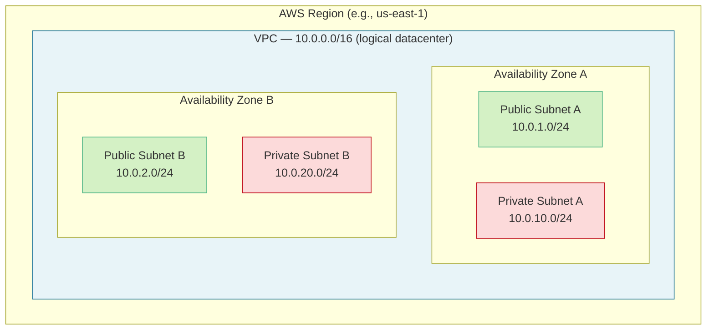

**Key rules:**
- VPC = **one Region**
- Subnet = **one AZ** (cannot span AZs)
- Green = public (has route to IGW). Red = private (no IGW route).
- AWS reserves 5 IPs per subnet (`.0`, `.1`, `.2`, `.3`, `.255`).

---

## 2. Public vs Private subnet — what makes them different

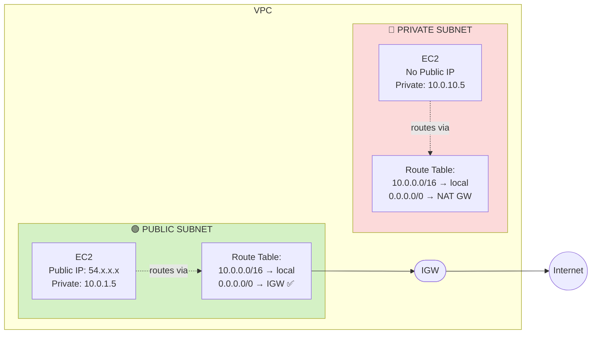

**The only difference:** the route table. Public subnet has `0.0.0.0/0 → IGW`. Private doesn't.

---

## 3. NAT Gateway flow — private EC2 reaches the internet

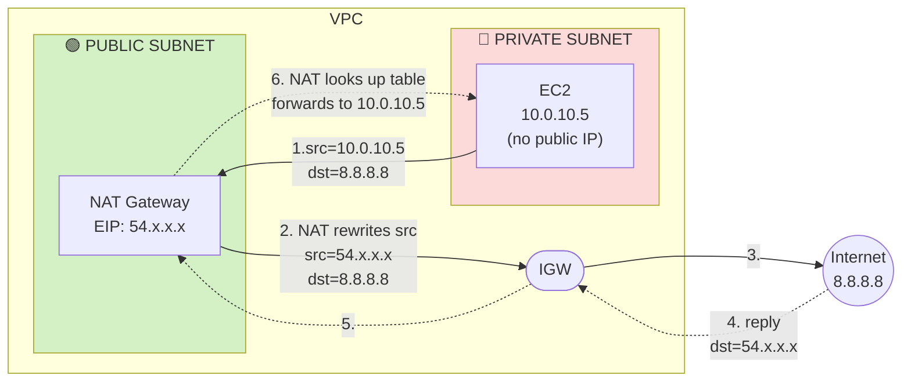

**Why NAT GW must be in a public subnet:** it needs `0.0.0.0/0 → IGW` itself to forward the rewritten packet.

---

## 4. Security Groups vs NACLs

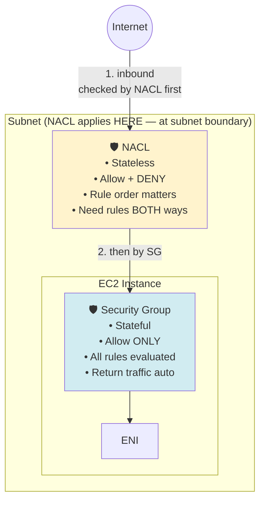

**Order on inbound:** Internet → **NACL** → **SG** → EC2.
**Order on outbound:** EC2 → SG → NACL → Internet.

**Exam triggers:**
- "Block a specific IP" → NACL (only one with Deny)
- "Timeout" → usually SG misconfiguration
- "Permission denied" → usually NACL
- "Custom NACL, instances can't talk" → deny-all default, add allow + ephemeral 1024-65535

---

## 5. VPC Endpoints — Gateway vs Interface

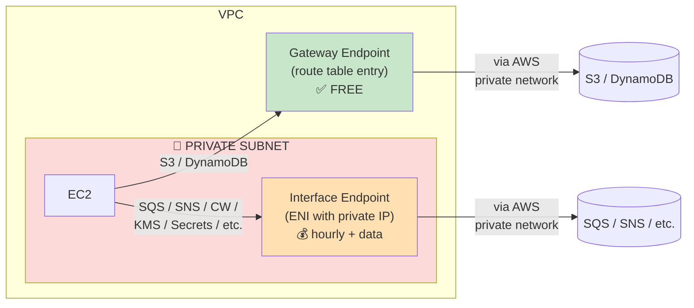

**Memorize:** Gateway Endpoint = **S3 + DynamoDB only, free, route table entry**. Interface Endpoint = **everything else, costs $$, creates an ENI**.

---

## 6. PrivateLink — exposing YOUR service to other VPCs

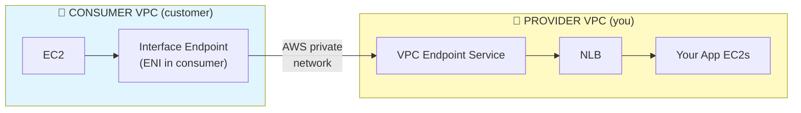

**Pattern to memorize:** Provider NLB + Endpoint Service ← Consumer Interface Endpoint. No peering, no public IPs, works across accounts.

---

## 7. VPC Peering — bidirectional, non-transitive

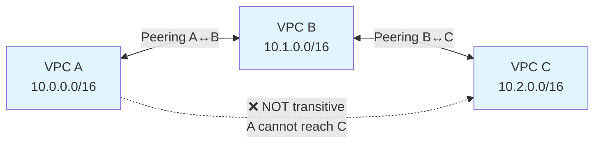

**Rules:**
- Non-transitive (A→B and B→C does NOT give A→C)
- No CIDR overlap
- Must update **route tables on BOTH sides**
- Same region or cross-region

---

## 8. Transit Gateway — hub-and-spoke

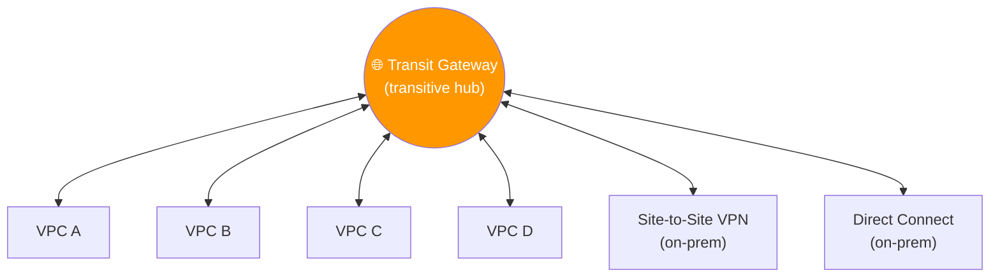

**Use it when:** 3+ VPCs need to talk, or you want a clean place to hang on-prem connectivity. Replaces the explosion of N×(N-1)/2 peering connections.

---

## 9. Hybrid connectivity — VPN vs DX vs DX+VPN

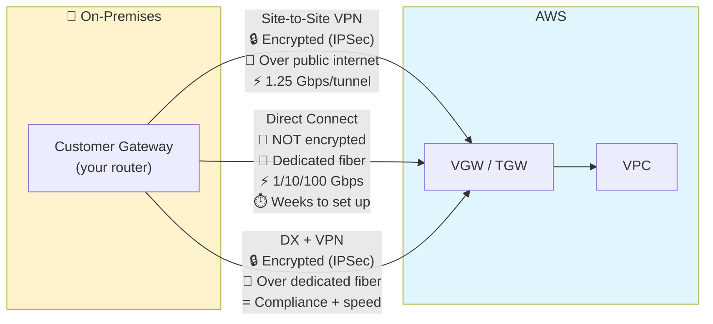

**Triggers:**
- "Encrypted, cheap" → VPN
- "Consistent latency, high bandwidth" → DX
- "Encrypted + dedicated" → DX + VPN over DX
- "Increase VPN bandwidth" → ECMP (only with **TGW** + VPN, NOT plain VGW)

---

## 10. DX maximum resiliency

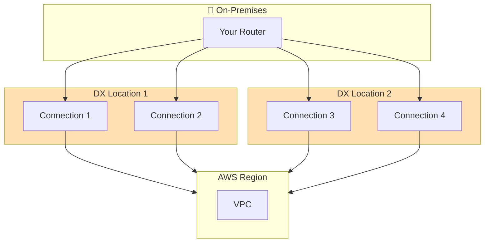

**Max resiliency = 2 connections × 2 locations = 4 total.** Survives device + location failure.

---

## 11. Bastion Host vs Session Manager

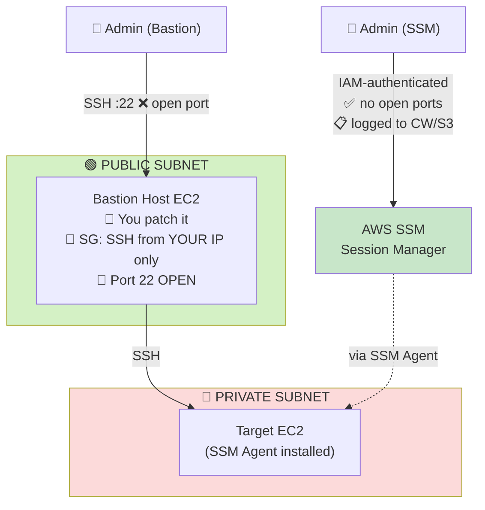

**Exam trigger:** "Most secure access to private instances" → **Session Manager** (always). Bastion is the trap answer.

---

## 12. Hybrid DNS — Route 53 Resolver

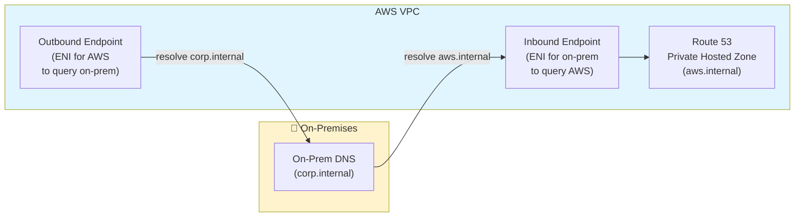

**Inbound endpoint** = on-prem queries AWS. **Outbound endpoint** = AWS queries on-prem.

---

## 13. The full picture — 3-tier app in one VPC

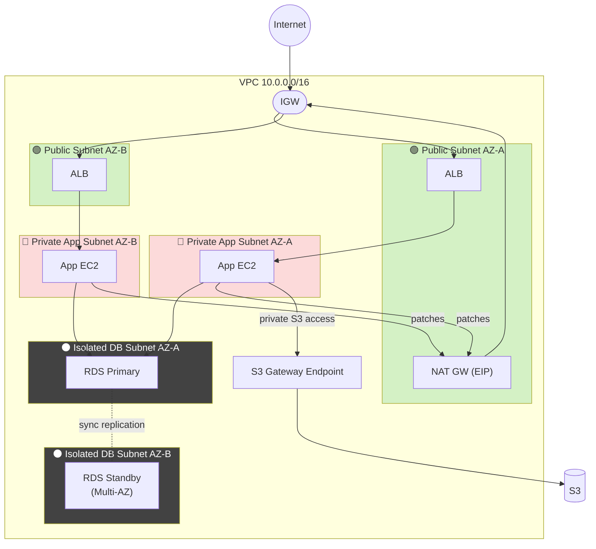

**Read this diagram as the AWS gold-standard reference architecture.** If a question shows you a deployment, mentally match it to this — anything missing is usually the answer.

> **Production HA note:** For full AZ-failure resilience, deploy **one NAT Gateway per AZ** (the diagram shows one for simplicity). NAT GW is **zonal** — if its AZ fails, instances in other AZs lose internet unless they have their own NAT GW. Exam trigger: *"highly available NAT"* → one per AZ.

---

## 14. Egress-Only Internet Gateway (IPv6)

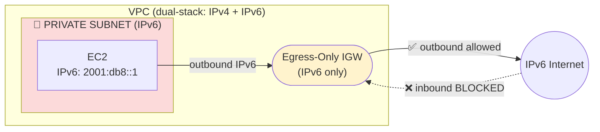

**Why it exists:** IPv6 has no private address range — every IPv6 is publicly routable. **Egress-Only IGW** is the IPv6 equivalent of NAT GW — outbound only, no inbound.

**Exam trigger:** *"IPv6 instances need outbound internet but must not be reachable from the internet"* → **Egress-Only IGW**.

---

## 15. VPN CloudHub — multi-branch hub-and-spoke

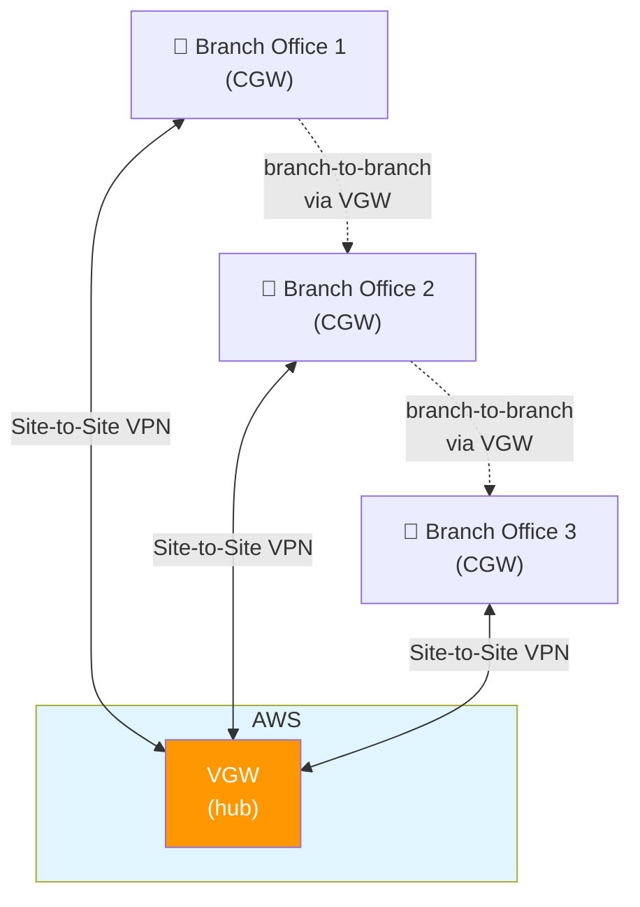

**The trick:** each branch only sets up ONE VPN to AWS, and AWS routes branch-to-branch traffic for them. No mesh of branch-to-branch VPNs needed.

**Exam trigger:** *"Connect multiple branch offices to each other through AWS"* → **VPN CloudHub**.

---

## 16. AWS Network Firewall — deep packet inspection

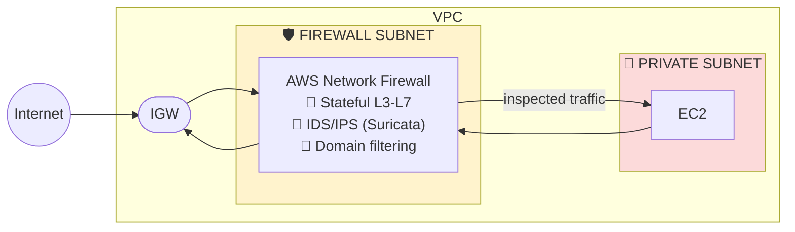

**Key point:** Network Firewall lives in its **own dedicated subnet**, and route tables direct traffic *through* it before it reaches workload subnets.

**Network Firewall vs SG/NACL:**
- SG/NACL = simple IP/port allow/deny (L3/L4).
- **Network Firewall = packet payload inspection, IDS/IPS, domain-name filtering, malicious-pattern detection (L3-L7).**

**Exam triggers:** *"Inspect traffic for malicious payloads"*, *"IDS/IPS at VPC level"*, *"Filter outbound by domain name"* → **AWS Network Firewall**.

---

## 17. Client VPN — remote user access

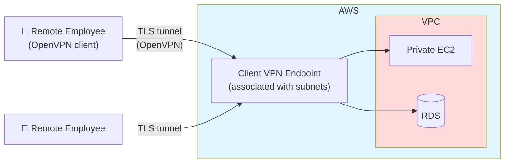

**Difference from Site-to-Site VPN:**
- **Client VPN** = **user-to-AWS** (individual remote workers, OpenVPN).
- **Site-to-Site VPN** = **network-to-network** (whole office to AWS, IPSec).

**Exam trigger:** *"Remote employees need VPN access to private AWS resources"* → **Client VPN**.

---

## 18. The 4 mental rules to take to the exam

1. **A subnet is "public" because of its route table, not its name.** `0.0.0.0/0 → IGW` makes it public.
2. **A private EC2 needs NO public IP.** The NAT GW lends it its own EIP via translation.
3. **NACL = subnet level, stateless, deny-capable. SG = ENI level, stateful, allow-only.**
4. **Peering ≠ transitive. TGW = transitive.** If the question says 3+ VPCs need to talk, the answer is TGW.
